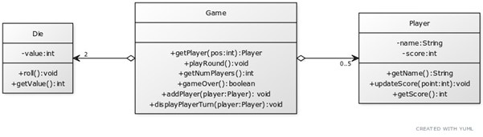

# Dice Game

## Introduction

There are several games with dice but the one that you are going to develop only requires two dice and some specific rules that are used to get some points. In this game up to five players will alternatively throw a pair of dice until one of the players has a score of 100 points or more, and therefore wins the game.

Here we have the rules of the game:
1.  	If the number 1 does not appear on either of the dice, the player adds the two dice values to their score and the turn passes to the next player.
2.  	If the number 1 appears on one die, nothing is added and the turn passes to the next player.
3.  	If the number 1 appears on both dice then the player loses all the accumulated points, and the turn passes to the next player.

To implement this game, we are going to develop three classes in addition to the main class. The classes are:

- Dice - stores the value on top of a dice and contains methods to simulate the roll of the dice
- Player - class that contains attributes to store the name and score of a player, and methods to return those attributes and to update the score
- Game – this class stores two dice and up to 5 players, the class knows the rules of the game, rolls the dice and calculates scores
- Main – this class creates the game, asks for the number of players and their names and play the game until a player wins.

You can start this program before the practical session if you wish. The solution will be developed in the class.

## Exercise 1: Class Dice

Implementation of the  class Dice, for the roll method you will need to use the random package

## Exercise 2: Class Player

Implementation of the class Player. This class only stores information about the player and does not play the game.

## Exercise 3: Class Game

This is the class that knows who is playing the game and the rules of the game. You will need to implement this class. A template of the class can be found in Replit,

## Exercise 4: Main Program

The main program asks for the name of the players, starts the game and plays it until there is a winner.
